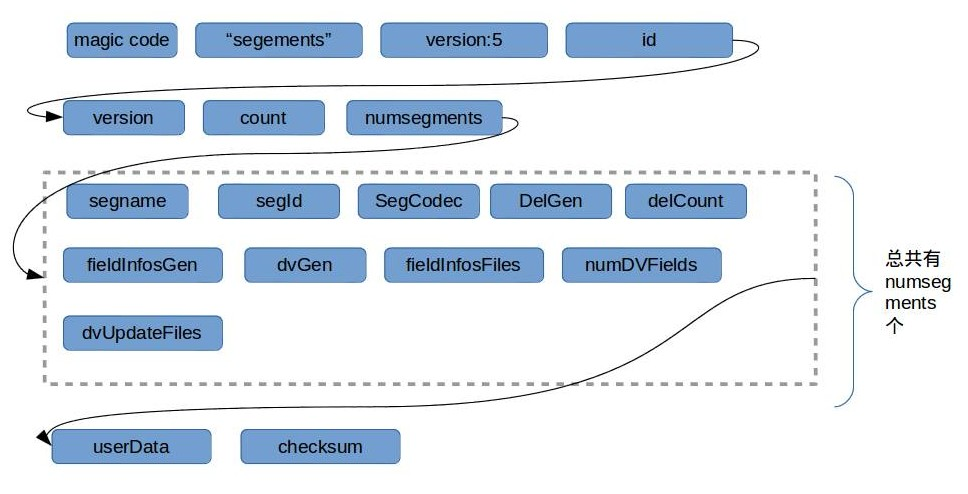
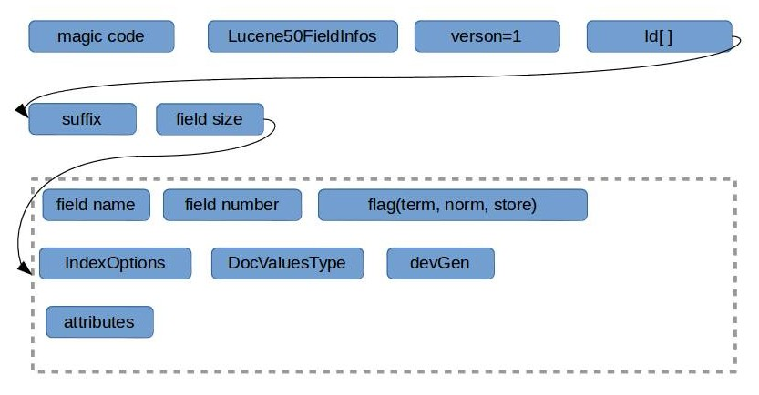
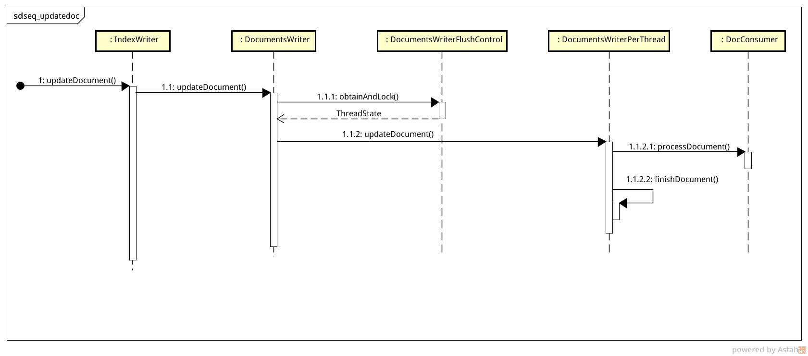
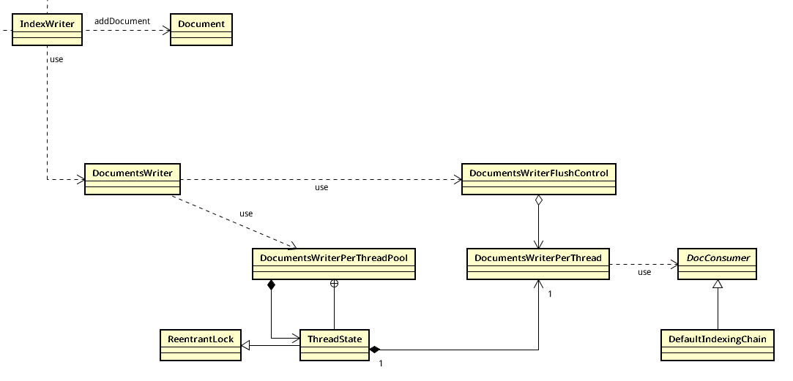

index(索引)

「索引」，可以作为一个动词，也可以是名词。作为动词的时候，指分析原始文件，分词，存储一系列动作；而作为名词，一般指已经处理好的索引文件。索引，是整个IR系统的核心，先有索引，再有查询。

所有索引文件保存在`Directory`下，一个索引包含很多不同作用的文件，其中有个文件最重要：segments_N，这个文件包含了很多元数据信息，比如当前索引的版本，segments数量。随便写个demo生成索引文件后，一般会有个segments_N文件，其中 N 是32进制的数字格式，如1，2，3 ...。分析下这个二进制文件(我用vim的%!xxd查看的)的数据：

我之所称这个文件是元数据信息，因为真正的索引数据不是放在这里，而只是保存了怎么读取索引文件的信息，可以理解成二级索引。上图中可以看到有个`numsegments`字段信息，这表示当前索引有多个 segment 存在，如果有多个，依次加载 segment 信息。每个 segment 文件名称一般以_0.si，_1.si，来保存的。举个例子，如果当前索引有两个segment块，则分别加载读取_0.si和_1.si的信息。记住一点：segment_N文件下保存了1到多个_n.si文件信息。那每个si文件包含哪些信息，同样查看下si二进制文件，有如下格式：

每个 segment 文件对应的都有一个文档字段信息数据文件，以 _0.fnm 命名的文件。参见代码（org.apache.lucene.codecs.lucene50.Lucene50FieldInfosFormat#read），其包含的信息为：

当更新索引文件时，包括新增，删除索引，一般中间过程中变更数据都放在内存中，当达到某些条件的时候会触发 flush 操作，即把内存的数据刷到文件中。flush 和 commit 是不同的两个东西，前者是把数据从内存中刷到文件系统中，后者代表一个事务的完成。也就是 flush 操作成功后，并不代表这些数据就是最终要保存的一致性数据。fush 策略由`FlushPolicy`负责，比如当内存使用或变更文档个数到达了预先设置的值，则触发flush。

Lucene索引文件具有有很高的吞吐量，官方描述如下：

> Scalable, High-Performance Indexing
> over 150GB/hour on modern hardware
>small RAM requirements -- only 1MB heap
> ...

这得益于Lucene内部实现种种细节的性能优化手段，如可以并发索引，先缓存数据在内存再批量刷新到文件。下图是一个在执行`IndexWriter.addDocument`时调用栈图：

从上图可以看到，所有的索引操作任务都通过内部一个`DocumentsWriterFlushControl`来调度，它具体的工作就是根据计算机的硬件参数(如CPU核数，内存大小)来控制并发量，并决定何时把内存的数据刷回到持久层文件中。我们再从类的关系图看下：

