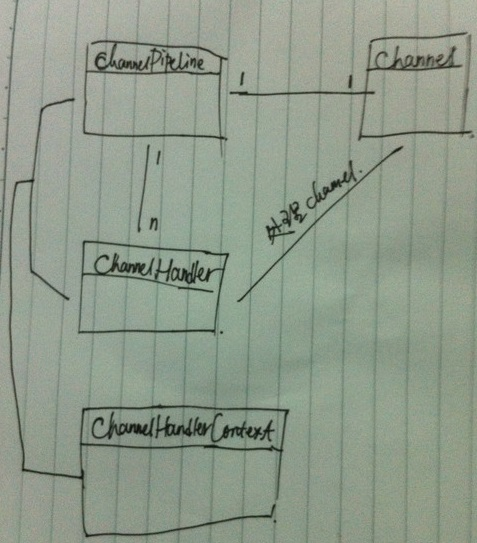

# Netty中和Channel相关的几个重要概念

## Channel
Channel,我可以理解成所有涉及到IO操作的统一接口,不管IO操作是基于网络,本地磁盘,还是进程内.这样很好的抽象了IO操作对象.

## ChannelFactory
生成Channel的工厂

## ChannelPipeline
在计算机术语中,所以和Pipeline相关的技术对象都是表达了相同的意思,中文翻译过来是"管道",这也很形象,管道的作用就是从某从东西从管道的一端流向别一端. 如在unix命令中, 用 `|` 表示一种管道技术. `ChannelPipeline`,即是处理`Channel`的一种管道.

## ChannelHandler
我们对`Channel`所有的操作(在Netty中,所有的操作都是异步的)都是交给`ChannelHandler`去处理.
关于`Channel`,`ChannelHandler`,`ChannelPipeline`的关联关系一定要理解清楚.
 

一个`Channel`只能而且唯一绑定一个`ChannelPipeline`. 一个`ChannelPipeline`可以绑定多个`ChannelHandler`. 

## ChannelEvent
`ChannelHandler`处理的对象就是`ChannelEvent`. 包括建立新的socket连接,收到流,发送流等. Netty是基于事件模型的组件,所有的处理工作都是基于事件的触发,状态流转.这点很重要.

## ChannelFuture
上面我们说过,Netty是基于异步的.所以任何的操作都只会返回`ChannelFuture`对象,就是操作会立即返回不会阻塞,但是该返回结果并不表示操作的运行结果.所以我们想对最终结果进行处理,必需通过两种方式,一是等待`ChannelFuture`执行完成,即阻塞式.二是对`ChannelFuture`添加事件监听器,当执行完成时触发操作,即非阻塞似的. Netty作者推荐后一种方式.

